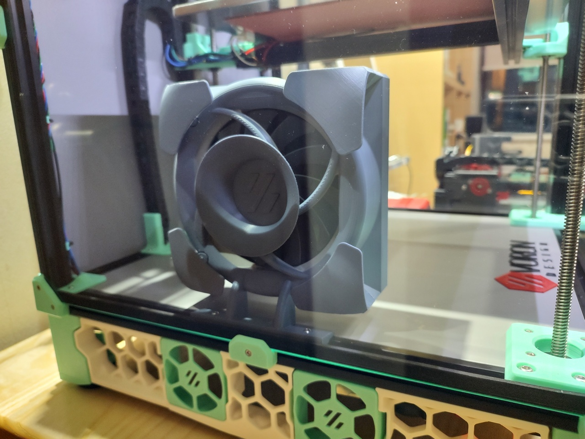
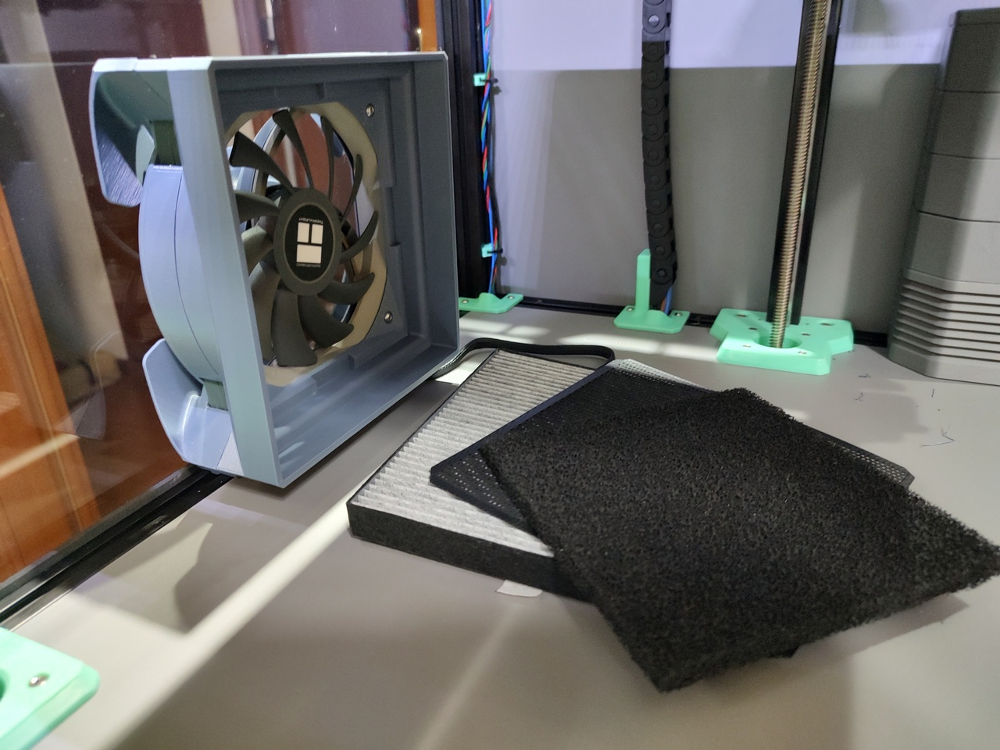
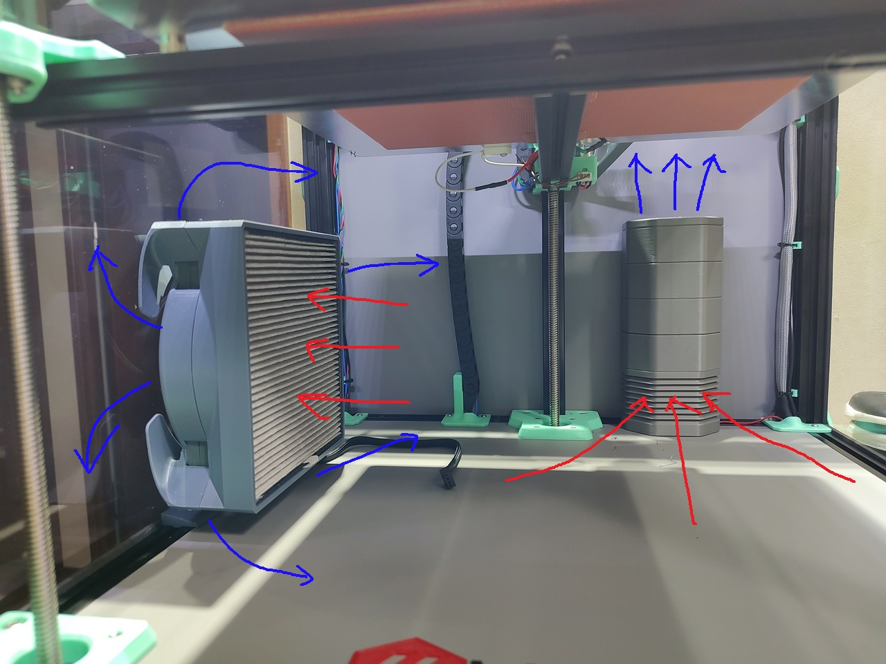
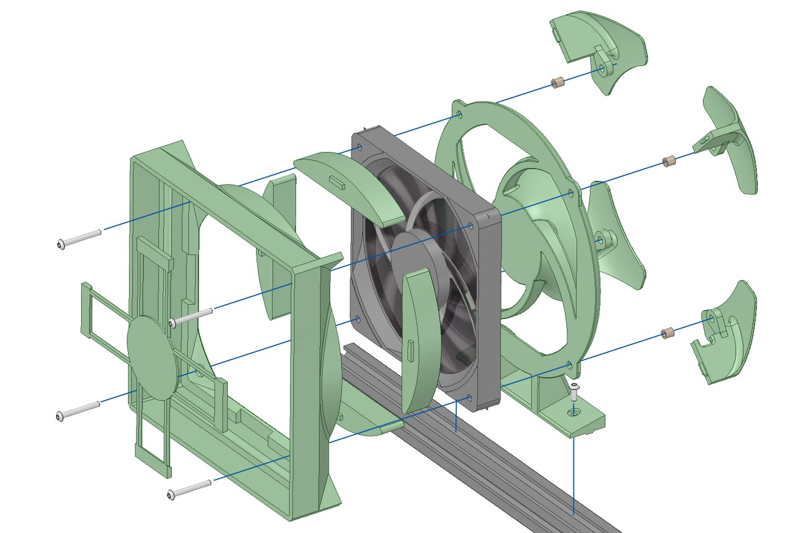
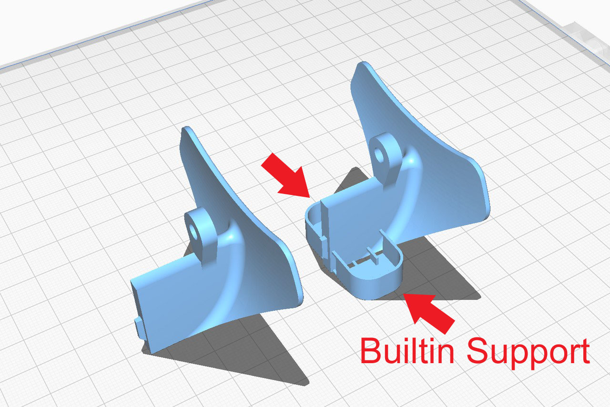
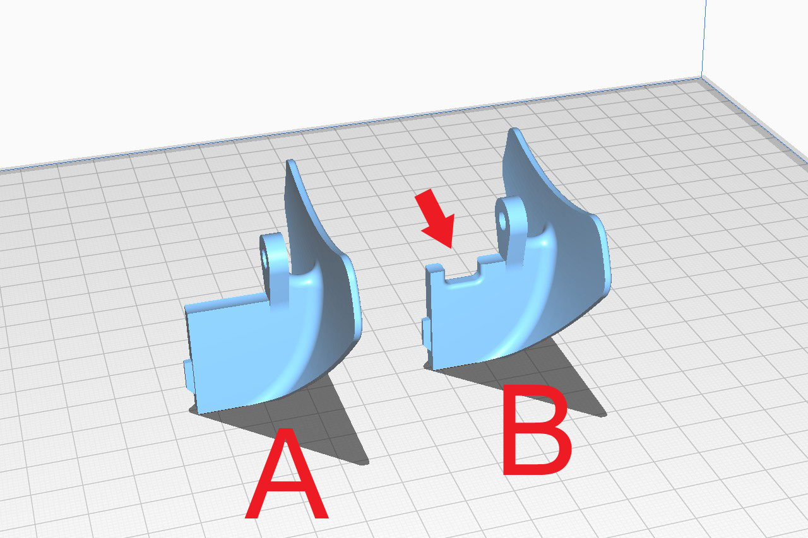

# 120mm Fan Filter for VORON TRIDENT

# Assemble

# Parts Printing
- All parts do not require support.
- Winglets have a narrow bottom area and are easily peeled off during printing.  
If the bed has weak adhesion, print WingletA_S.stl and WingetB_S.stl with built-in anti-tip supports.  

- Winglet B has a notch for fan wiring.  
Depending on the wiring path, usually three A's and one B are printed.  

# BOM
- M3 x 20mm or 25mm BHCS x4
- M3 x 8mm BHCS x2
- M3 Insert Nut x4
- M3 Roll-in T-nut x1
- 120mm x 15mm Fan x1 (Thermalright TL-C12015 or, 2000rpm or higher)
- 150mm x 150mm x 15mm Filter x1 (Sharp IZ-FGCF15)
- 130mm x 130mm x 10mm Activated Carbon Sponge Filter x1 (Universal)

option
- Mini360 DC-DC Converter x1

